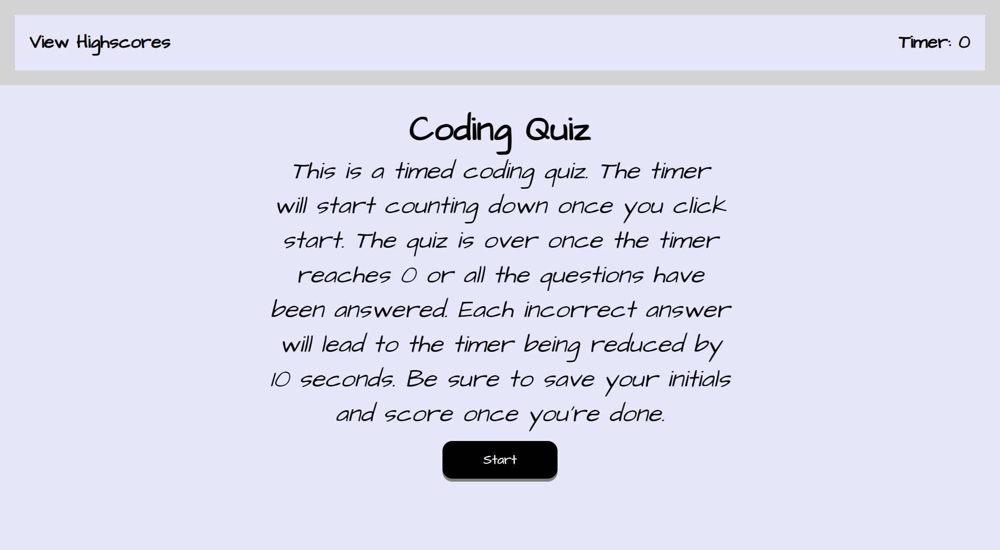

# Module 4 | Web APIs Challenge: Code Quiz
## Web APIs Challenge: Code Quiz
## Description
This is the completed application of the code quiz for the Module 4 Web APIs Challenge. The purpose of this challenge was to make a timed multiple-choice quiz. It runs in the browser and features updated HTML and CSS that is powered by JavaScript code. This quiz also meets the certain criteria of being timed, a penalty of losing 10 seconds for every incorrect answer, as well as being able to save the user's initials and score after each attempt. 
## Screenshot

## Deployed Link
Link to deployed application:
https://thitareep.github.io/Mod4_CodeQuiz/